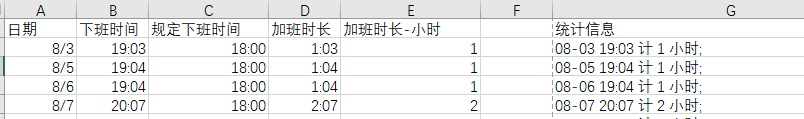

# 记一次 Excel 的使用经历

## Reference

- [计算两个时间之间的差值](https://support.microsoft.com/zh-cn/office/%E8%AE%A1%E7%AE%97%E4%B8%A4%E4%B8%AA%E6%97%B6%E9%97%B4%E4%B9%8B%E9%97%B4%E7%9A%84%E5%B7%AE%E5%80%BC-e1c78778-749b-49a3-b13e-737715505ff6)
- [INT 函数](https://support.microsoft.com/zh-cn/office/int-%E5%87%BD%E6%95%B0-a6c4af9e-356d-4369-ab6a-cb1fd9d343ef)
- [TEXT 函数](https://support.microsoft.com/zh-cn/office/text-%E5%87%BD%E6%95%B0-20d5ac4d-7b94-49fd-bb38-93d29371225c)
- [将两个或更多个单元格的文本合并到一个单元格](https://support.microsoft.com/zh-cn/office/%E5%B0%86%E4%B8%A4%E4%B8%AA%E6%88%96%E6%9B%B4%E5%A4%9A%E4%B8%AA%E5%8D%95%E5%85%83%E6%A0%BC%E7%9A%84%E6%96%87%E6%9C%AC%E5%90%88%E5%B9%B6%E5%88%B0%E4%B8%80%E4%B8%AA%E5%8D%95%E5%85%83%E6%A0%BC-81ba0946-ce78-42ed-b3c3-21340eb164a6)

------------------------------------------------------------------------------------------------------------------------

考虑到加班申请，同事同学说自己弄个 Excel 表统计好再申请，就接触了一点点 Excel 的东西。

简单需求就是把每天上下班时间汇总，然后向下取整加班时长，并格式化输出字符串（逐渐程序员化）。

例如下图：

其中涉及了：
- 计算时间间隔：`=B2-C2`
- 时间间隔按小时计向下取整：`=INT(D2*24)`
  - 或者：`=TEXT(B2-C2, "h")`
- 
- 格式化统计信息：`=CONCAT(TEXT(A2, "MM-DD")," ",TEXT(B2, "HH:MM"), " 计 ",E2,  " 小时;", CHAR(10))`

需要注意的是：
1. 日期需要选择合适的字段类型（感觉这个挺麻烦的
2. 日期时间间隔直接相减即可
3. 日期时间类型转整数使用`INT()`函数，但根据想转的格式，需要乘以不同的系数，或者使用`TEXT()`函数，具体可参考官方文档
4. 字符串拼接使用`CONCAT()`函数，其中换行符使用`CHAR(10)`来替代，时间类型使用`TEXT()`函数转换成文本
5. 公式中好像只允许使用双引号，单引号会报错
